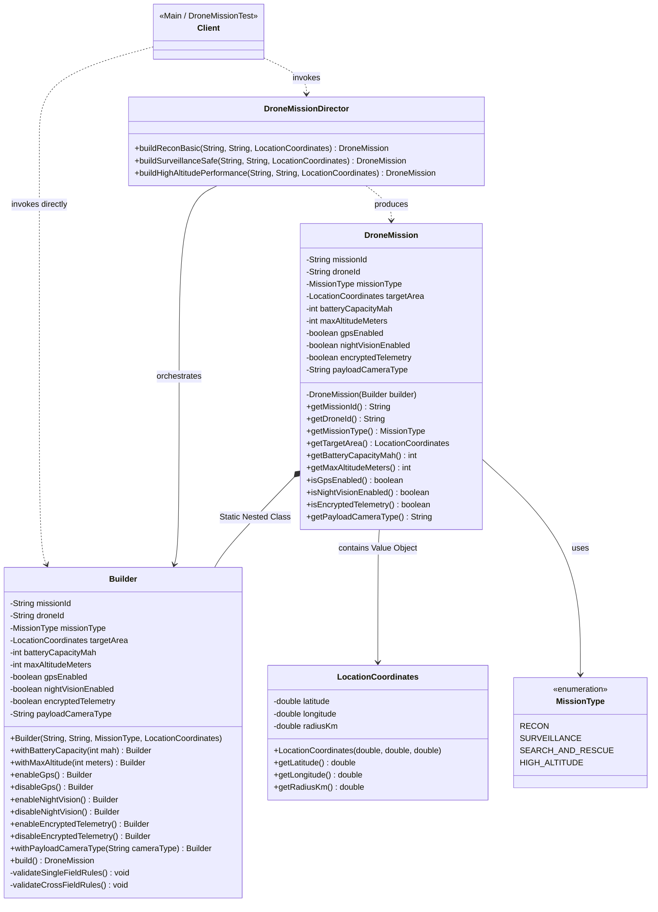
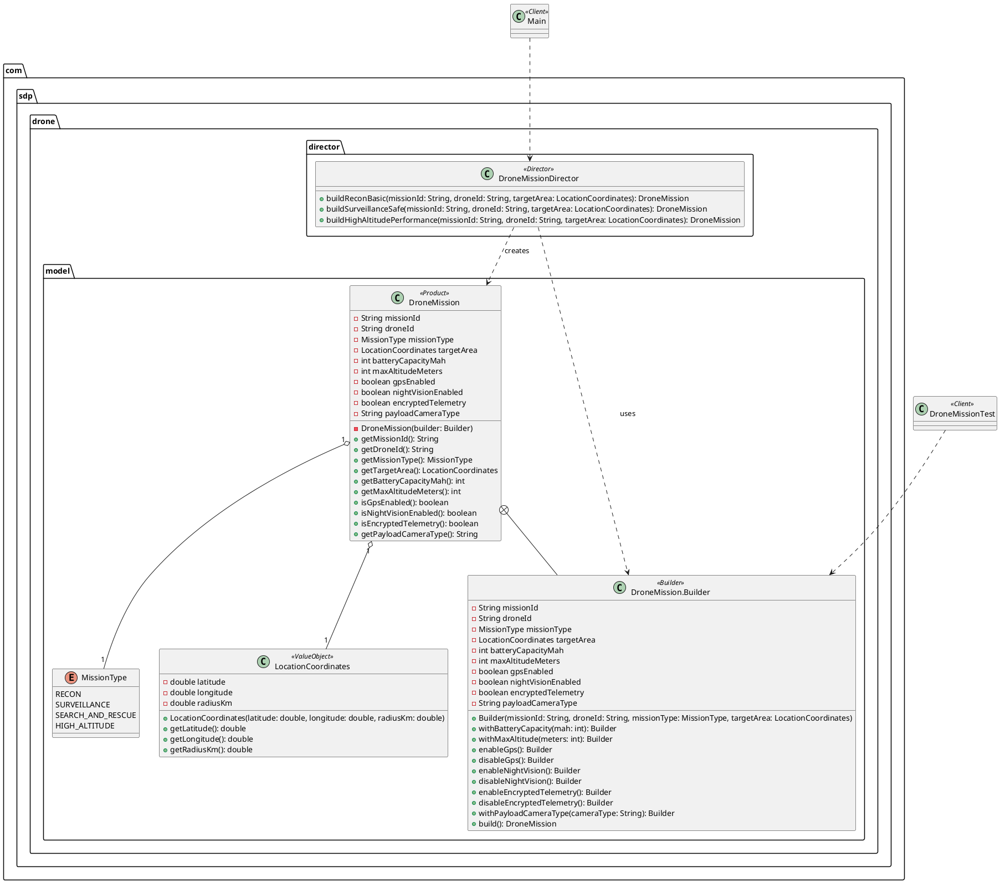

# UML Architecture & Traceability Matrix

## 1. Class Diagram (Mermaid)

---

## 2. PlantUML Representation

---

## 3. Pattern Role Traceability Table

| Pattern Role | Implementation Class | Responsibilities & Design Notes |
| :--- | :--- | :--- |
| **Product** | `DroneMission` | Complex target object. Immutable (`private final` fields, no setters). Created strictly via Builder constructor. |
| **Builder** | `DroneMission.Builder` | Static nested class. Provides fluent API, stores step-by-step state, defaults, and enforces single-field and cross-field validation rules in `build()`. |
| **Director** | `DroneMissionDirector` | Defines predefined mission configurations (`RECON_BASIC`, `SAFE_SURVEILLANCE`, `HIGH_ALTITUDE`). Enforces construction sequence. |
| **Value Object** | `LocationCoordinates` | Immutable nested domain object encapsulated within `DroneMission`. Validates coordinate boundaries upon creation. |
| **Client** | `Main` / `DroneMissionTest` | Instantiates products either directly using `DroneMission.Builder` or via `DroneMissionDirector` presets. |
